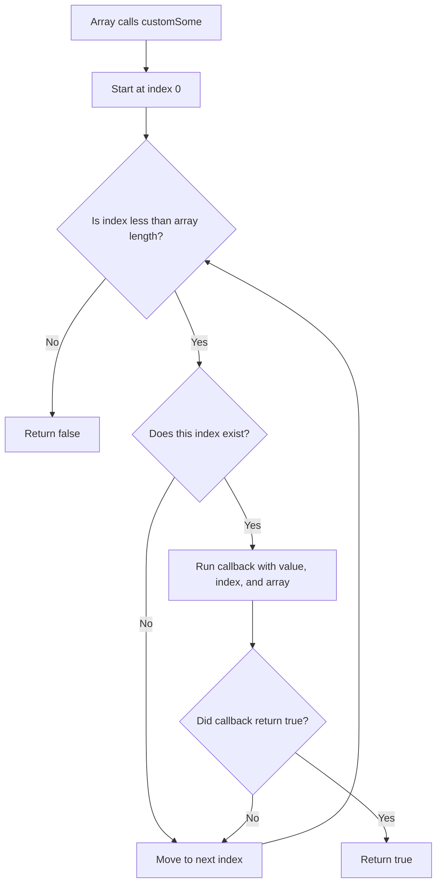

# Custom Array.prototype.some

This project solves a simple JavaScript problem.

The goal is to create a custom version of the built-in JavaScript `some()` array method.

---

## What The Function Does

The function name is:

```js
customSome(cb, thisArg)
```

It is added to `Array.prototype`, so it can be used like this:

```js
array.customSome(callback)
```

It receives:

- `cb`: a callback function that checks each array value
- `thisArg`: an optional value used as `this` inside the callback

---

## Expected Output

The function should return:

- `true` if at least one item passes the callback condition
- `false` if no item passes the callback condition

It stops checking as soon as it finds one matching item.

---

## Example

```js
const numbers = [1, 3, 5, 8];

numbers.customSome((num) => num % 2 === 0);
```

Output:

```js
true
```

Explanation:

- `1` is not even
- `3` is not even
- `5` is not even
- `8` is even

Because one number matches the condition, the function returns `true`.

---

## Another Example

```js
const numbers = [1, 3, 5];

numbers.customSome((num) => num % 2 === 0);
```

Output:

```js
false
```

No number is even, so the function returns `false`.

---

## How It Works

The function loops through the array using an index:

```js
for (let i = 0; i < this.length; i++)
```

Here, `this` means the array that called `customSome`.

For each index, it checks:

```js
i in this
```

This makes sure the index actually exists in the array.

Then it calls the callback:

```js
cb.call(thisArg, this[i], i, this)
```

The callback receives:

1. the current value
2. the current index
3. the full array

If the callback returns `true`, `customSome` immediately returns:

```js
true
```

If the loop finishes and nothing matches, it returns:

```js
false
```

---

## Diagram

This diagram shows how `customSome` checks the array.



Example flow:

```text
[1, 3, 5, 8]

1 -> callback returns false -> keep checking
3 -> callback returns false -> keep checking
5 -> callback returns false -> keep checking
8 -> callback returns true  -> return true
```

---

## Important Note

This function behaves like `Array.prototype.some`.

It does not need to check every item if one item already matches.

That is why this line returns immediately:

```js
if (i in this && cb.call(thisArg, this[i], i, this)) return true;
```

---

## Concepts Learned

- JavaScript functions
- Arrays
- `Array.prototype`
- Callback functions
- `this`
- `thisArg`
- `call()`
- `for` loops
- Early return

---

## Final Outcome

The function successfully adds a custom `some()` method to arrays and returns whether at least one array item passes the callback condition.
