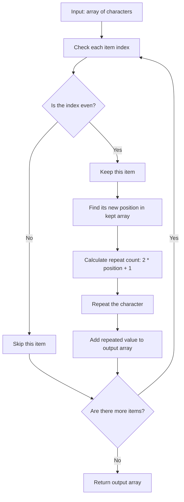

# Repeat Characters

This project solves a simple JavaScript problem.

The goal is to take characters from an array and repeat selected characters a specific number of times.

---

## What The Function Does

The function name is:

```js
getRepeatedArray(collection)
```

It receives:

- `collection`: an array of strings or characters

If no array is passed, it uses an empty array by default.

---

## Expected Output

The function should return a new array.

It does two main things:

1. Keeps only the items at even indexes.
2. Repeats those kept items using odd numbers: `1`, `3`, `5`, `7`, and so on.

---

## Example

```js
getRepeatedArray(["a", "b", "c", "d", "e"])
```

Output:

```js
["a", "ccc", "eeeee"]
```

Explanation:

Original array:

```text
Index:  0    1    2    3    4
Value: "a"  "b"  "c"  "d"  "e"
```

The function keeps only even indexes:

```text
Index 0 -> "a"
Index 2 -> "c"
Index 4 -> "e"
```

Then it repeats them:

```text
"a" repeats 1 time  -> "a"
"c" repeats 3 times -> "ccc"
"e" repeats 5 times -> "eeeee"
```

---

## How It Works

The function uses:

```js
collection.filter((_, i) => i % 2 === 0)
```

This keeps only values where the index is even.

Then it uses:

```js
.map((x, i) => x.repeat(2 * i + 1))
```

This repeats each kept value.

The formula is:

```js
2 * i + 1
```

This creates odd repeat counts:

```text
i = 0 -> 2 * 0 + 1 = 1
i = 1 -> 2 * 1 + 1 = 3
i = 2 -> 2 * 2 + 1 = 5
```

---

## Diagram

This diagram shows how the function filters and repeats the characters.



Example flow:

```text
["a", "b", "c", "d", "e"]

"a" at index 0 -> keep -> repeat 1 time  -> "a"
"b" at index 1 -> skip
"c" at index 2 -> keep -> repeat 3 times -> "ccc"
"d" at index 3 -> skip
"e" at index 4 -> keep -> repeat 5 times -> "eeeee"
```

---

## Concepts Learned

- JavaScript functions
- Arrays
- Default parameters
- `filter()`
- `map()`
- Index checking
- Modulo operator `%`
- `repeat()`

---

## Final Outcome

The function successfully returns a new array where characters from even indexes are repeated in increasing odd counts.
