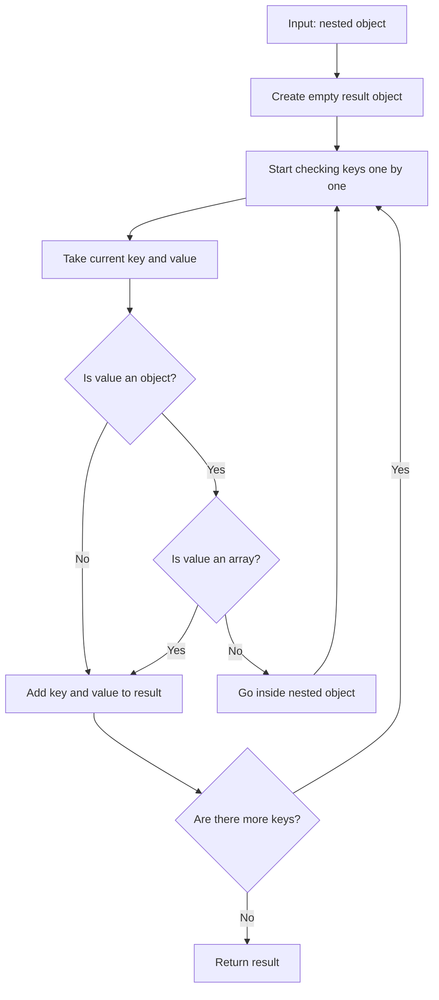

# Flatten Nested Object - II

This project solves a simple JavaScript problem.

The goal is to take a nested object and return a new object where all nested values are moved to the top level.

---

## What The Function Does

The function name is:

```js
flattenObject(collection)
```

It receives:

- `collection`: an object that may contain other objects inside it

---

## Expected Output

The function should return a new flat object.

If a value is a normal value, it is added to the result.

If a value is another object, the function goes inside that object and continues checking its keys.

Arrays are not flattened. They are added as values.

---

## Example

```js
flattenObject({
  name: "Amit",
  address: {
    city: "Delhi",
    pin: 110001
  },
  marks: {
    math: 90,
    science: 85
  }
})
```

Output:

```js
{
  name: "Amit",
  city: "Delhi",
  pin: 110001,
  math: 90,
  science: 85
}
```

Explanation:

- `name` is already a normal value, so it is added directly
- `address` is an object, so the function goes inside it
- `city` and `pin` are added to the result
- `marks` is also an object, so the function goes inside it
- `math` and `science` are added to the result

---

## Important Note

This solution keeps only the final key name.

It does not create keys like:

```js
"address.city"
```

Instead, it creates:

```js
city
```

So if two nested objects contain the same key, the later value can overwrite the earlier one.

---

## How It Works

The function starts with an empty object:

```js
const result = {};
```

Then it creates a helper function called `flat`.

The helper function checks each key in the current object:

1. Get the value of the current key.
2. If the value is another object and not an array, call `flat` again.
3. If the value is not a nested object, add it to `result`.
4. Return `result` after all keys are checked.

This process is called recursion because the helper function calls itself.

---

## Diagram

This diagram shows how the function checks each value and decides what to do.



Example flow:

```text
name: "Amit"      -> normal value -> add to result
address: {...}    -> nested object -> go inside it
city: "Delhi"     -> normal value -> add to result
pin: 110001       -> normal value -> add to result
```

---

## Concepts Learned

- JavaScript functions
- Objects
- `for...in` loops
- Recursion
- `typeof`
- `Array.isArray()`
- Nested object traversal

---

## Final Outcome

The function successfully converts a nested object into a flat object by moving nested values to the top level.
