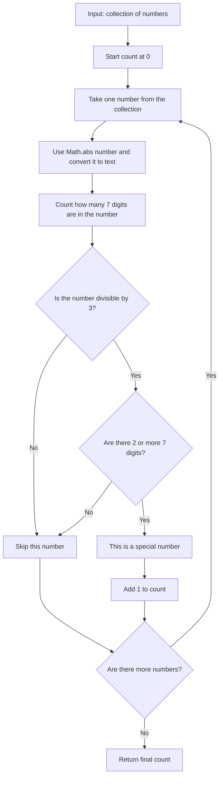

# Count Special Numbers

This project solves a simple JavaScript problem.

The goal is to count how many numbers in a collection are **special numbers**.

---

## What The Function Does

The function name is:

```js
countSpecialNumbers(collection)
```

It receives:

- `collection`: an array of numbers

---

## Special Number Rule

A number is counted as special when:

- it is divisible by `3`
- it contains the digit `7` at least two times

The function also works with negative numbers because it checks the digits using the absolute value.

---

## Expected Output

The function should return:

- the total count of special numbers in the array
- `0` if no number matches the rule

---

## Example

```js
countSpecialNumbers([777, 72, 177, 37, -777])
```

Output:

```js
3
```

Explanation:

- `777` is divisible by `3` and has three `7` digits
- `72` is divisible by `3`, but has only one `7`
- `177` is divisible by `3` and has two `7` digits
- `37` has one `7` and is not divisible by `3`
- `-777` is divisible by `3` and has three `7` digits

So the special numbers are:

```js
777, 177, -777
```

---

## How It Works

The function starts with:

```js
let count = 0;
```

Then it checks every number in the collection.

For each number:

1. Convert the absolute value of the number to a string.
2. Check if the original number is divisible by `3`.
3. Count how many times the digit `7` appears.
4. Increase `count` only when both conditions are true.

The number of `7` digits is found using:

```js
str.split('7').length - 1
```

Example:

```js
"777".split("7")
```

This creates four empty parts, so:

```js
4 - 1 = 3
```

That means `777` has three `7` digits.



Example path:

```text
777 -> divisible by 3 -> has at least two 7 digits -> count it
72  -> divisible by 3 -> has only one 7 digit -> skip it
37  -> not divisible by 3 -> skip it
```

---

## Concepts Learned

- JavaScript functions
- Arrays
- `for...of` loops
- Modulo operator `%`
- String conversion
- `Math.abs()`
- `split()`
- Conditional checks

---

## Final Outcome

The function successfully counts all numbers that are divisible by `3` and contain the digit `7` at least two times.
