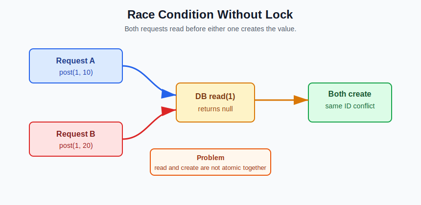
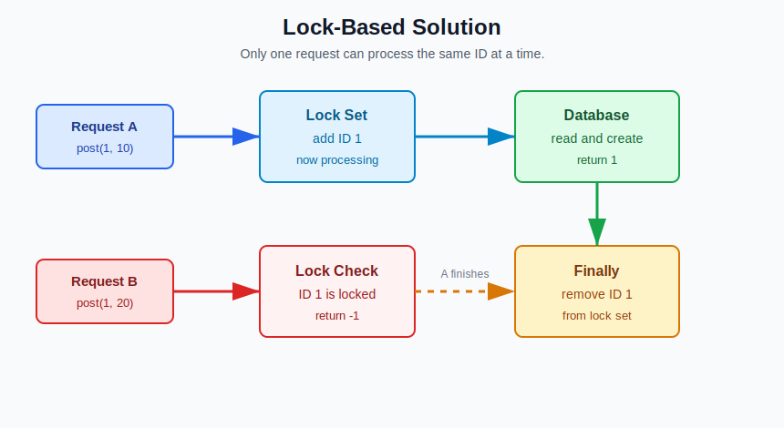

# Async Fetcher System

This project is based on a simple asynchronous database system using JavaScript.

The goal was to implement a `Fetcher` class that can:

- store values
- get values
- prevent duplicate IDs
- handle concurrent requests safely

---

## What Was Given

A `DB` class was already provided.

It had two asynchronous methods:

### `read(id)`

Checks whether a value exists for the given ID.

Returns:

- the value if found
- `null` if not found

### `create(id, value)`

Stores the value in the database.

Both methods are asynchronous and take around 10ms to complete.

---

## What Needed To Be Implemented

The `Fetcher` class needed two methods:

### `get(id)`

Expected behavior:

- return the value if the ID exists
- return `-1` if the ID does not exist

### `post(id, value)`

Expected behavior:

- store the value if the ID is new
- return `-1` if the ID already exists
- return `1` after successful insertion

---

## Initial Approach

At first, the logic looked simple:

```js
const isThere = await this.db.read(id)

if (isThere !== null) {
  return -1
}

await this.db.create(id, value)
return 1
```

This worked for normal test cases, but some hidden test cases failed.

---

## Actual Problem

The issue happened during concurrent requests.

Example:

```js
fetch.post(1, 10)
fetch.post(1, 20)
```

Both requests were running at almost the same time.



---

## Why It Failed

Both requests checked the database at nearly the same moment:

```js
await this.db.read(id)
```

Both received:

```js
null
```

So both requests tried to store a value for the same ID.

This created a race condition.

---

## What Is a Race Condition?

A race condition happens when multiple asynchronous operations access or modify the same data at the same time, and the final result depends on which operation finishes first.

Real-life example:

Two people try to book the same movie seat at the same time.

Both see the seat as available.

Both try to book it.

This creates a conflict.

---

## Final Solution

To solve this, a temporary lock system was added using a JavaScript `Set`.



Before processing an ID:

- check if the ID is already being processed
- if yes, return `-1`
- otherwise, temporarily lock the ID
- perform the database operation
- remove the lock after completion

This prevents multiple parallel `post` requests from inserting the same ID.

---

## Final Logic

The final `post` logic follows this order:

```js
if (this.pending.has(id)) {
  return -1
}

this.pending.add(id)

try {
  const existingValue = await this.db.read(id)

  if (existingValue !== null) {
    return -1
  }

  await this.db.create(id, value)
  return 1
} finally {
  this.pending.delete(id)
}
```

The `finally` block is important because it removes the ID from the lock set even if something goes wrong during the async operation.

---

## Why `Set` Was Useful

A `Set` stores unique values.

That means the same ID cannot be added again while it is already being processed.

Example:

```js
this.pending.add(1)
this.pending.has(1) // true
```

This made it perfect for tracking IDs that are currently being inserted.

---

## Time And Space Complexity

### `get(id)`

- Time complexity: `O(1)` average database lookup
- Space complexity: `O(1)`

### `post(id, value)`

- Time complexity: `O(1)` average database lookup and insert
- Space complexity: `O(n)` in the worst case, where `n` is the number of IDs being processed at the same time

---

## Important Detail

One hidden test expected a success return value after insertion.

So after storing the data, this was added:

```js
return 1
```

After this change, all test cases passed.

---

## Concepts Learned

- Async/Await
- Promises
- Race Conditions
- Concurrency Handling
- Locking Mechanism
- JavaScript `Set`
- Asynchronous Database Operations

---

## Final Outcome

All test cases passed, including hidden concurrent test cases.

This problem helped me understand how asynchronous operations can create real-world concurrency issues, even in simple code.
